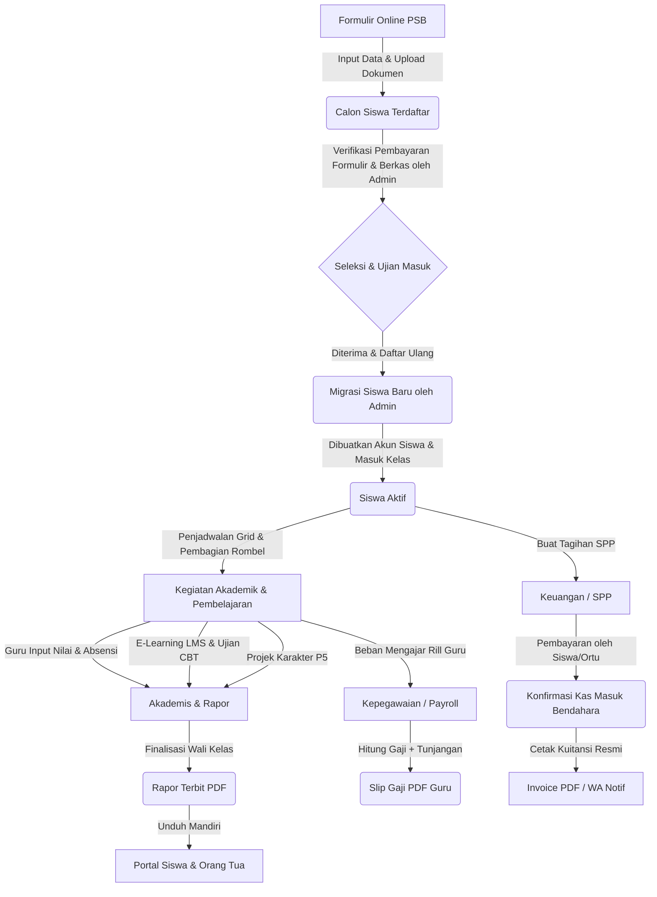

# DOKUMENTASI TEKNIS 06 - PANDUAN PENGGUNA (MANUAL BOOK)

## PEMBDA HUB - Sistem Informasi Manajemen Sekolah Terpadu
**Yayasan Perguruan Pembangunan Daerah Nias (PEMBDA)**  
**Alamat:** Jl. Pelita No.9 Kelurahan Ilir Kota Gunungsitoli Propinsi Sumatera Utara (22815)  
**Versi:** 3.0.0  
**Tanggal:** 11 Juni 2026  
**Status:** Production Ready (Overhauled)  

---

## 1. PENDAHULUAN

**Pembda Hub** adalah sistem manajemen sekolah terintegrasi berbasis web yang dirancang khusus untuk mengelola operasional akademik, keuangan, kepegawaian, pembelajaran, dan ujian di bawah naungan **Yayasan Perguruan Pembangunan Daerah Nias (PEMBDA)**.

Sistem ini mendukung pengelolaan terpadu bagi 3 unit sekolah:
1. **SMPS Pembda 2 Gunungsitoli** (ID: 1 - Sekolah Menengah Pertama)
2. **SMA Swasta Pembda 1 Gunungsitoli** (ID: 2 - Sekolah Menengah Atas)
3. **SMKS Swasta Pembda Nias** (ID: 3 - Sekolah Menengah Kejuruan)

### 1.1 Visi & Misi Sistem
* **Sentralisasi Data**: Mengintegrasikan data master siswa, guru, kelas, dan alumni dalam satu database tunggal.
* **Transparansi Keuangan**: Mempermudah pelacakan pembayaran uang sekolah (SPP/UPP/DPP), denda keterlambatan secara otomatis, dan pelaporan keuangan.
* **Digitalisasi Akademik**: Menyediakan media e-learning (LMS), ujian berbasis komputer (CBT) anti-curang, absensi waktu-nyata, dan penerbitan Rapor Digital (PDF) otomatis.
* **Efisiensi SDM**: Menghitung beban mengajar guru secara riil untuk dasar penggajian (slip gaji) bulanan yang akurat.

### 1.2 Persyaratan Sistem (System Requirements)
Untuk menjamin kenyamanan dan kelancaran saat menggunakan PembdaHub, pastikan perangkat keras dan perangkat lunak Anda memenuhi spesifikasi berikut:
* **Peramban (Browser)**: Google Chrome, Mozilla Firefox, Microsoft Edge, atau Safari versi terbaru (sangat direkomendasikan Google Chrome v100+).
* **Resolusi Layar**: Minimal 1280x720 piksel (resolusi laptop standar); direkomendasikan 1366x768 piksel ke atas untuk visualisasi optimal pada modul *Schedule Grid* dan diagram keuangan.
* **Koneksi Internet**: Koneksi stabil minimal 2 Mbps untuk navigasi dashboard harian, dan minimal 10 Mbps pada saat pelaksanaan Ujian Online (CBT).

---

## 2. MEMULAI APLIKASI (GETTING STARTED)

Bagian ini dirancang untuk membantu pengguna baru dalam mengakses sistem, melakukan login pertama kali, dan melakukan konfigurasi dasar akun.

### 2.1 Akses & Login Pertama Kali
1. Buka peramban (browser) di komputer atau handphone Anda.
2. Masukkan alamat website sekolah: `http://perguruanpembda.com` (atau `http://localhost/pembdahub` di server lokal).
3. Di halaman utama, klik tombol **Login** pada pojok kanan atas.
4. Masukkan **Username** (biasanya berupa NISN bagi siswa, NIP/NIDN bagi guru, atau alamat email) dan **Password** default yang telah dibagikan oleh admin tata usaha sekolah.
5. Klik **Masuk** untuk masuk ke dalam aplikasi.

### 2.2 Mengganti Kata Sandi (Change Password)
> [!WARNING]
> **Wajib Mengubah Password Pertama Kali**  
> Untuk menjaga privasi dan keamanan akun Anda, sistem secara otomatis akan mendeteksi status login pertama. Pengguna baru akan dipaksa untuk mengubah password default sebelum diizinkan mengakses menu dashboard utama.

Langkah-langkah mengubah password:
1. Jika status akun Anda mendeteksi login pertama, sistem akan mengalihkan halaman ke form **Ubah Password**.
2. Masukkan kata sandi lama/bawaan pada kolom kata sandi lama.
3. Masukkan kata sandi baru Anda (minimal 8 karakter, kombinasi huruf dan angka) di kolom password baru.
4. Masukkan kembali password baru di kolom konfirmasi, lalu klik **Update Password**.
5. Setelah berhasil, Anda akan dialihkan secara aman ke dashboard utama sesuai peranan Anda.

### 2.3 Memahami Peran Ganda (Switch Role)
Aplikasi PembdaHub mendukung Single Sign-On (SSO) internal yang canggih. Pengguna yang memiliki tugas ganda (seperti seorang **Guru** yang juga menjabat sebagai **Wali Kelas** atau **Kepala Sekolah**) dapat beralih panel kerja secara instan tanpa perlu logout terlebih dahulu.
1. Tombol beralih peran terletak di bagian atas panel navigasi samping (sidebar).
2. Klik tombol peran yang ingin dituju (misal: "Beralih ke Wali Kelas" atau "Beralih ke Kepala Sekolah").
3. Sidebar navigasi akan otomatis berubah menyesuaikan hak akses peran terpilih secara real-time.

### 2.4 Quick Start: Langkah Cepat per Peran
* **Admin Sekolah**: Perbarui **Profil Sekolah & KKM**, atur **Tahun Ajaran & Semester** aktif, lalu import data **Guru & Siswa** untuk memulai sistem.
* **Bendahara**: Periksa data kelas rombel, lalu masuk ke menu **Tagihan Massal** untuk menerbitkan SPP bulan berjalan bagi siswa.
* **Guru**: Buka menu **Jadwal Mengajar** untuk melihat sebaran kelas, buat **Course LMS** baru, dan unggah bahan ajar.
* **Siswa**: Lengkapi data profil, periksa **Jadwal Pelajaran** harian, lalu masuk ke LMS untuk membaca materi pelajaran aktif.
* **Orang Tua**: Pilih profil anak Anda, periksa status **Presensi Hari Ini**, dan lihat rincian tagihan SPP berjalan.

---

## 3. LEVEL & HAK AKSES PENGGUNA (ROLES)

Pembda Hub menerapkan kontrol akses berbasis peran (*Role-Based Access Control / RBAC*) yang ketat. Terdapat **9 level pengguna** dengan rincian tugas dan fungsi masing-masing:

### 3.1 Super Admin
* **Fungsi Utama**: Administrator utama sistem di bawah Yayasan yang memegang kontrol penuh atas konfigurasi seluruh unit sekolah.
* **Tugas Pokok**:
  * Mengelola akun pengguna (Super Admin, Admin Sekolah, Bendahara, Guru, Orang Tua, Siswa, Yayasan).
  * Melakukan reset kata sandi massal atau individual.
  * Mengonfigurasi data sekolah global dan parameter utama tahun ajaran/semester.
  * Memantau dashboard analitik gabungan seluruh unit sekolah.

### 3.2 Admin Sekolah
* **Fungsi Utama**: Pengelola administrasi spesifik untuk satu unit sekolah (misal: hanya SMP, hanya SMA, atau hanya SMK).
* **Tugas Pokok**:
  * Mengelola data master siswa, guru, rombel/kelas, dan mata pelajaran pada unit sekolahnya.
  * Mengonfigurasi kurikulum sekolah, bobot nilai kelulusan (KKM), dan bobot nilai rapor.
  * Menyusun jadwal pelajaran visual (*Schedule Grid*) dan memecahkan bentrok jadwal (*conflict detection*).
  * Mengelola gelombang pendaftaran Penerimaan Siswa Baru (PSB) tingkat unit sekolah.
  * Memverifikasi dokumen pendaftar PSB dan memigrasikan mereka menjadi siswa aktif.
  * Mengelola penempatan PKL siswa (khusus SMK) dan melacak data Alumni (Tracer Study & Lowongan Kerja).
  * Mengonfigurasi format, menunjuk pembimbing, mengelola pengajuan judul, serta menjadwalkan ujian Tugas Akhir/Proyek Kelas XII.

### 3.3 Bendahara (Treasurer)
* **Fungsi Utama**: Pengelola administrasi keuangan sekolah (SPP, DPP, uang seragam, buku, dan biaya penunjang lainnya).
* **Tugas Pokok**:
  * Membuat tagihan bulanan (*bills*) baik secara massal per kelas maupun per siswa secara manual.
  * Mencatat pembayaran (*payments*) cicilan maupun lunas dari siswa/orang tua.
  * Melakukan pemutihan (*waive*) denda keterlambatan siswa jika terjadi keadaan darurat/kebijakan khusus.
  * Mencetak kuitansi pembayaran resmi (*receipt* PDF) untuk bukti pembayaran siswa.
  * Mengekspor laporan penerimaan dan tunggakan keuangan ke Excel/CSV.

### 3.4 Guru
* **Fungsi Utama**: Pendidik yang mengelola pembelajaran di kelas masing-masing.
* **Tugas Pokok**:
  * Melakukan input absensi harian siswa secara cepat per kelas (*quick bulk attendance*).
  * Melakukan penginputan nilai tugas, UTS, UAS, dan sikap secara massal untuk mata pelajaran yang diampunya.
  * Menggunakan Asisten AI untuk merancang RPP (Lesson Plan) dan membuat Soal CBT secara otomatis.
  * Mengelola kelas maya di LMS (mengunggah materi, membuat tugas dengan batas waktu, membuat kuis multiple-choice).
  * Mengelola Bank Soal dan mengaktifkan ujian di sistem CBT (Computer Based Test).
  * Memeriksa dan menilai jawaban esai di CBT, serta melakukan sinkronisasi nilai CBT ke rapor.
  * Memantau dan menyetujui jurnal harian (logbook) siswa bimbingan PKL di lapangan (khusus pembimbing SMK).
  * Menjadi Pembimbing Tugas Akhir (me-review logbook, memberi umpan balik, menyetujui kelayakan ujian) atau Penguji Tugas Akhir (sidang).

### 3.5 Wali Kelas
* **Fungsi Utama**: Guru yang ditugaskan memimpin satu rombongan belajar (kelas). Wali Kelas mendapatkan semua menu Guru ditambah menu administrasi kelas dan rapor.
* **Tugas Pokok**:
  * Memantau keaktifan siswa dan melihat riwayat absensi kelas bimbingannya.
  * Menulis catatan perkembangan dan rekomendasi bimbingan konseling (BK) untuk siswanya.
  * Mengelola penilaian projek karakter P5 dan cetak Rapor P5.
  * Melakukan proses *generate* Rapor Digital di akhir semester, mengisi deskripsi catatan wali kelas, mempublikasikan rapor, dan mengunduh rapor kelas secara kolektif (ZIP).

### 3.6 Kepala Sekolah
* **Fungsi Utama**: Memegang hak akses pemantauan makro atas kinerja akademik unit sekolah yang dipimpinnya.
* **Tugas Pokok**:
  * Memantau rekap absensi guru, staf, dan kehadiran siswa secara global.
  * Meninjau grafik sebaran nilai akademik siswa per kelas.
  * Memantau rancangan KBM guru di LMS/CBT.
  * Menyetujui dan memberikan tanda tangan/cap digital untuk penerbitan Rapor Digital kelas.
  * Menggunakan fitur Switch Role untuk beralih kembali ke peran guru aktif.

### 3.7 Siswa
* **Fungsi Utama**: Pengguna akhir yang memanfaatkan portal siswa untuk pembelajaran dan evaluasi mandiri.
* **Tugas Pokok**:
  * Melihat jadwal pelajaran harian, jadwal ujian, nilai akademik, rekap absensi, dan tagihan SPP.
  * Mengakses materi pembelajaran, mengumpulkan tugas (*file upload*), mengerjakan kuis, dan forum diskusi di portal LMS.
  * Mengikuti ujian online (CBT) dengan sistem anti-cheat (deteksi pindah tab).
  * Mengisi jurnal harian aktivitas PKL di lapangan (khusus SMK).
  * Mengajukan judul Tugas Akhir (Penelitian Ilmiah untuk SMA, Project Akhir untuk SMK), memperbarui logbook bimbingan secara berkala, dan mengunggah dokumen laporan akhir.

### 3.8 Orang Tua (Wali)
* **Fungsi Utama**: Memantau perkembangan akademik dan kewajiban administrasi anak mereka secara real-time.
* **Tugas Pokok**:
  * Memantau tingkat kehadiran/absensi anak di sekolah.
  * Melihat nilai tugas dan ujian anak.
  * Mengunduh Rapor Digital anak dalam bentuk PDF setelah statusnya resmi dirilis (*published*) oleh Wali Kelas.
  * Memantau status pembayaran tagihan SPP dan denda akumulasi jika terlambat membayar.
  * Melihat riwayat bimbingan konseling dan catatan pembinaan anak di sekolah.

### 3.9 Yayasan (Ketua Yayasan)
* **Fungsi Utama**: Pengawas dan pemegang kebijakan makro untuk memantau perkembangan sekolah dan sirkulasi keuangan.
* **Tugas Pokok**:
  * Mengakses dashboard eksekutif yang menyajikan rekapitulasi data pendaftar PSB di seluruh unit.
  * Mengirim undangan pelatihan peningkatan kompetensi guru secara single maupun bulk.
  * Memantau rekapitulasi total pendapatan tagihan keuangan dan tunggakan per unit sekolah.
  * Melihat laporan beban kerja guru, total pengeluaran gaji (*payroll*) bulanan, dan slip gaji guru.

---

## 4. PETA MENU UTAMA APLIKASI

Berikut adalah visualisasi struktur menu yang muncul di panel navigasi (sidebar) berdasarkan hak akses pengguna:

### 4.1 Panel Administrator (Super Admin & Admin Sekolah)
* **Dashboard**: Statistik siswa aktif, guru, kelas, grafik bulanan penerimaan kas, dan jumlah pendaftar PSB.
* **Manajemen User**: Tambah pengguna, edit data profil, ubah peranan, dan tombol reset password.
* **Sekolah & Kelas**:
  * Unit Sekolah: Pengaturan profil sekolah dan KKM.
  * Tahun Ajaran & Semester: Konfigurasi periode akademik aktif.
  * Rombel/Kelas: Daftar kelas, kuota daya tampung, pengelompokan jurusan (khusus SMK berdasarkan Program/Konsentrasi Keahlian), penugasan Wali Kelas, dan pembagian siswa ke kelas.
* **Data Master**:
  * Siswa: Database siswa aktif, impor data via Excel/CSV, ganti foto, dan set kartu RFID.
  * Guru & Pegawai: Database guru, kompetensi mengajar, dan riwayat posisi jabatan.
  * Mata Pelajaran: Database mata pelajaran dan impor massal.
  * Jam Pelajaran (Time Slots): Pengaturan waktu slot belajar mengajar.
* **Akademik**:
  * Penugasan Mengajar: Menghubungkan Guru dengan Mata Pelajaran dan Kelas.
  * Jadwal Pelajaran (Grid): Penyusunan jadwal pelajaran visual dengan algoritma pendeteksi bentrok jam mengajar/ruang kelas.
  * Monitoring Absensi: Rekapitulasi absensi harian dan bulanan siswa.
  * Bimbingan Konseling (BK): Rekam medis pembinaan sikap siswa dan penanganan kasus pelanggaran.
* **Kepegawaian (SDM)**:
  * Dashboard SDM: Statistik pegawai aktif, status kepegawaian (PNS/Yayasan/Honorer/Kontrak).
  * Absensi Pegawai: Rekap kehadiran staf dan guru, persetujuan cuti/izin pegawai.
  * Beban Kerja (Workload): Penghitungan total jam mengajar guru rill vs wajib, tunjangan struktural/keluarga/beras, konfirmasi, dan kunci data beban kerja.
  * Laporan Gaji (Payroll): Pencarian slip gaji bulanan, ekspor laporan rekapitulasi penggajian ke CSV, dan cetak slip gaji (PDF).
* **PSB (Penerimaan Siswa Baru)**:
  * Pendaftar Baru: Filter dan verifikasi status pembayaran pendaftaran, verifikasi piagam prestasi, tes masuk, pengumuman kelulusan, dan migrasi pendaftar ke siswa aktif.
  * Pengaturan PSB: Setup kuota gelombang pendaftaran, biaya formulir, dan kustomisasi berkas wajib diunggah.
  * Notifikasi PSB: Dasbor monitoring WhatsApp Fonnte untuk mengirim pesan konfirmasi pendaftaran, jadwal tes, dan pengumuman secara otomatis.
* **Kelola PKL & Alumni**:
  * Penempatan PKL: Menginput data mitra industri, pembimbing internal, mentor industri, dan periode magang siswa SMK.
  * Tracer Study: Rekam penelusuran karir dan studi lanjut alumni dari semua unit sekolah.
  * Lowongan Pekerjaan: Publikasi info karir/lowongan kerja bagi alumni.
* **Pengendalian Proyek / Tugas Akhir**:
  * Format Tugas Akhir: Mengunggah template format penulisan proposal/laporan akhir.
  * Pengajuan & Plotting: Menerima pengajuan judul Tugas Akhir kelas XII, serta mem-plot Guru Pembimbing.
  * Penjadwalan Ujian: Menentukan Guru Penguji, waktu, dan ruangan sidang akhir bagi siswa yang layak.
* **CBT & LMS Monitoring**: Pemantauan aktivitas ujian dan materi pembelajaran online di seluruh unit sekolah.
* **Konten Website**: Kelola Berita, Kelola Galeri, Konten Umum.

### 4.2 Panel Keuangan (Bendahara / Treasurer)
* **Dashboard Keuangan**: Grafik tren pendapatan harian/bulanan, rasio pelunasan tagihan kelas, dan log transaksi terbaru.
* **Manajemen Tagihan (Bills)**:
  * Buat Tagihan Massal: Menentukan jenis biaya (SPP/Uang Seragam/Uang Buku) untuk seluruh siswa di tingkat kelas tertentu secara otomatis.
  * Daftar Tagihan: Filter tagihan jatuh tempo, belum lunas, lunas, cicilan, dan denda terlambat.
  * Pemutihan Denda (*Waive*): Tombol khusus untuk menghapus denda keterlambatan siswa.
  * Ekspor Tagihan: Mengunduh data tunggakan ke format Excel/CSV.
* **Pencatatan Pembayaran (Payments)**:
  * Terima Pembayaran: Formulir pencarian tagihan aktif siswa berdasarkan NISN/Nama, perhitungan denda otomatis, dan pembayaran parsial/lunas.
  * Log Pembayaran: Riwayat kas masuk, cetak kuitansi PDF resmi berlogo sekolah.
  * Pembayaran Massal: Input data kas masuk massal untuk setoran tunai kolektif.
* **Laporan Keuangan**: Unduh laporan rekap penerimaan kas bulanan, semester, dan tunggakan tagihan per rombel.

### 4.3 Panel Guru & Wali Kelas / Kepala Sekolah
* **Dashboard**: Jadwal mengajar hari ini, daftar tugas/kuis LMS yang perlu dinilai, dan shortcut input nilai.
* **Jadwal Pelajaran**: Tampilan jadwal mengajar mingguan guru bersangkutan.
* **Kelas & Siswa**: Daftar rombongan belajar yang diajar beserta daftar riwayat siswa.
* **Input Nilai (Grades)**:
  * Pilihan Kelas & Mata Pelajaran: Input nilai bulk berdasarkan jenis (tugas, UTS, UAS, sikap).
  * Rekap Nilai: Ringkasan capaian kompetensi dan rerata nilai siswa kelas tersebut.
* **Absensi Siswa**:
  * Input Absensi bulk per tanggal dengan satu klik (Set All Hadir / Sakit / Izin / Alpha).
* **Asisten AI**:
  * RPP Generator: Membuat draf Rencana Pelaksanaan Pembelajaran (RPP) menggunakan kecerdasan buatan.
  * Pembuat Soal CBT: Membuat bank soal ujian pilihan ganda dan esai secara otomatis menggunakan AI.
* **LMS (Learning Management System)**:
  * Kelola Course: Membuat ruang materi belajar.
  * Kelola Modul & File: Mengunggah modul PDF, video link, materi dokumen pendukung.
  * Kelola Tugas (Assignments): Form pembuatan tugas lengkap dengan deadline pengumpulan, instruksi, dan panel penunjang penilaian (nilai & feedback).
  * Kelola Kuis (LMS Quiz): Pembuatan soal latihan mandiri untuk siswa.
  * Forum Diskusi & Pengumuman: Berinteraksi dengan siswa secara interaktif, menyematkan balasan terbaik (*best answer*), atau mengunci forum diskusi.
* **CBT (Computer Based Test)**:
  * Bank Soal: Mengisi bank soal (pilihan ganda dengan 4 opsi atau esai).
  * Ujian (Exams): Form pendaftaran jadwal ujian online, memasukkan kode token akses (*access code*), merandom urutan soal/opsi jawaban, mengaktifkan ujian, monitoring siswa yang sedang ujian, jeda ujian massal, penilaian manual esai, dan tombol *Sync Grades* ke Rapor.
* **Monitoring PKL (Khusus SMK)**:
  * Jurnal Magang: Memantau dan meninjau logbook aktivitas harian siswa PKL di lapangan.
* **Bimbingan & Ujian Proyek**:
  * Bimbingan Tugas Akhir: Meninjau logbook bimbingan siswa, memberikan umpan balik (feedback), dan menandai status kesiapan ujian.
  * Ujian Tugas Akhir: Menginput penilaian hasil presentasi/sidang akhir proyek siswa bimbingan.
* **Raport Digital (Wali Kelas Saja)**:
  * Generate Raport: Menghitung rerata nilai otomatis berdasarkan bobot sekolah (Tugas/UTS/UAS/Sikap) dan absensi semester riil anak.
  * Raport Projek (P5): Mengelola projek P5, target sub-elemen kompetensi pancasila, penilaian sikap kualitatif, input catatan projek, dan cetak Rapor P5.
  * Catatan Wali Kelas: Formulir input perkembangan kepribadian/sikap siswa.
  * Finalisasi & Rilis: Mengunci status rapor dan mempublikasikannya agar orang tua bisa mengunduh.
  * Unduh Rapor ZIP: Fitur bulk download seluruh PDF rapor siswa satu kelas.

### 4.4 Panel Siswa
* **Dashboard Portal**: Ringkasan persentase penyelesaian LMS, informasi tagihan aktif, rata-rata nilai, dan status kehadiran bulan ini.
* **Jadwal Pelajaran**: Kalender jadwal harian siswa.
* **Akademik**:
  * Nilai Saya: Grafik riwayat nilai per mata pelajaran dan semester.
  * Kehadiran: Rekap bulanan persentase absensi kehadiran di kelas.
  * Tagihan: Detail rincian tagihan uang sekolah yang wajib dibayarkan lengkap dengan denda berjalan.
  * Konseling: Catatan perkembangan perilaku/bimbingan dari guru BK.
* **E-Learning (LMS)**:
  * Katalog Course: Mendaftar (*Self-Enroll*) ke kelas materi baru.
  * Materi: Membaca dokumen materi dan melacak kemajuan membaca (*Material Progress Tracking*).
  * Tugas: Mengunggah berkas jawaban tugas (*resubmission support* jika diizinkan guru).
  * Kuis LMS: Mengerjakan kuis latihan berbatas waktu.
  * Forum Diskusi Kelas: Bertanya di forum diskusi pelajaran dan membalas postingan guru/siswa lain.
* **Ujian Online (CBT)**:
  * Daftar Ujian: Mengakses ujian aktif, memasukkan token ujian, dan mulai menjawab soal.
  * Ruang Ujian: Menampilkan 1 soal per halaman, timer hitung mundur, navigasi nomor soal (ragu-ragu), pelacakan anti-curang (tab switches tracking).
  * Riwayat & Hasil: Melihat hasil skor langsung (jika hasil di-publish oleh guru) atau melakukan review jawaban salah-benar.
* **Magang/PKL (Khusus SMK)**:
  * Jurnal Magang: Formulir pengisian aktivitas harian kerja praktek dan unggah dokumen/foto bukti kegiatan.
* **Proyek & Tugas Akhir (Kelas XII)**:
  * Dashboard Tugas Akhir: Melihat status pengajuan judul, mengunduh format panduan penulisan.
  * Logbook Bimbingan: Mengajukan judul baru, menginput progress bimbingan, melampirkan berkas kemajuan, dan melihat feedback pembimbing.

### 4.5 Panel Orang Tua (Wali)
* **Dashboard**: Memilih anak, grafik capaian prestasi anak, total tunggakan, dan ringkasan pelanggaran.
* **Monitoring Anak**:
  * Jadwal & Presensi: Melihat jadwal belajar anak dan status kehadirannya hari ini secara real-time.
  * Nilai Akademik: Melihat seluruh rekapitulasi nilai tugas, UTS, UAS, dan sikap anak per semester.
  * Tagihan Keuangan: Melihat rincian tagihan anak, nominal jatuh tempo, denda berjalan, dan riwayat pembayaran cicilan sebelumnya.
  * Unduh Rapor: Men-download file PDF Rapor hasil belajar anak secara mandiri tanpa harus ke sekolah (jika sudah dirilis wali kelas).
  * Catatan Konseling: Memantau pembinaan bimbingan konseling anak di sekolah.

### 4.6 Panel Yayasan
* **Dashboard Eksekutif**: Ringkasan visual total siswa, guru, staf, rasio keuangan kas masuk global, dan statistik grafik pendaftar PSB di 3 sekolah.
* **Laporan Yayasan**:
  * Penerimaan PSB: Rekapitulasi pendaftaran online per gelombang dan pendapatan kas formulir PSB.
  * Laporan Keuangan Gabungan: Neraca ringkas tagihan bulanan diterbitkan vs terbayar di SMPS Pembda 2, SMA Pembda 1, dan SMKS Pembda Nias.
  * Penggajian (SDM): Dashboard pengeluaran gaji guru per bulan, laporan total beban kerja, dan detail penggajian guru berstatus PNS maupun Yayasan.
  * Undangan Pelatihan: Pengiriman undangan pelatihan (single/bulk) untuk guru.

### 4.7 Pembda Elite (Fitur Lintas Peran)
* **Hub Forum & Kolaborasi**: Forum diskusi global lintas peran untuk berbagi informasi, mengikuti proyek, kepanitiaan sekolah, dan melakukan donasi/charity.
* **Hall of Fame & Leaderboard**: Papan peringkat keaktifan siswa dan guru berdasarkan poin reputasi terakumulasi.
* **Pelatihan PembdaHub**: Akses modul materi pelatihan untuk peningkatan mutu SDM di lingkungan sekolah Pembda.

---

## 5. INTEGRASI ALUR KERJA UTAMA SISTEM

Bagian ini memaparkan bagaimana modul-modul di Pembda Hub saling terhubung untuk menciptakan ekosistem sekolah tanpa kertas (*paperless*) di Yayasan Perguruan Pembda Nias.



#### 5.1 Alur PSB ke Siswa Aktif (Modul PSB)
1. **Pendaftaran Mandiri**: Calon siswa/orang tua mengakses situs publik PembdaHub, memilih unit sekolah (SMP/SMA/SMK). Jika memilih SMK, calon siswa wajib memilih **Program Keahlian** dan **Konsentrasi Keahlian** yang diinginkan.
2. **Notifikasi Pendaftaran**: Sistem secara otomatis mengirimkan pesan konfirmasi pendaftaran berisikan nomor registrasi (misal: `PSB-SMKS-2026-0001`) via WhatsApp (Fonnte API) ke nomor orang tua.
3. **Verifikasi Pembayaran & Berkas**: Admin Sekolah memeriksa bukti transfer pembayaran formulir dan kelayakan dokumen pendukung yang diunggah. Setelah valid, status calon siswa dinaikkan menjadi `document_verified`.
4. **Input Nilai Tes**: Calon siswa mengikuti ujian masuk. Admin menginput perolehan skor ujian, merubah status menjadi `scored`, kemudian memutuskan penerimaan (`accepted`).
5. **Daftar Ulang & Migrasi**: Calon siswa melakukan daftar ulang pembayaran biaya masuk sekolah awal. Admin menekan tombol **Migrate** pada dashboard PSB. Sistem secara otomatis akan memindahkan datanya ke data siswa aktif, membuat user account, dan mengirimkan kredensial login siswa baru via WhatsApp.

> **Bagan Alir (Flowchart):**
> `Daftar Online` &rarr; `Verifikasi Berkas` &rarr; `Tes Masuk` &rarr; `Bayar` &rarr; `Migrasi Aktif`

### 5.2 Alur Penyusunan Jadwal & Kegiatan Belajar (Modul Akademik)
1. **Konfigurasi Time Slots**: Admin Sekolah membagi jam pelajaran harian di menu *Time Slots* (misalnya: SMP 8 jam pelajaran, SMK 15 jam pelajaran karena ada praktik bengkel).
2. **Penyusunan Jadwal Visual (Grid)**: Admin menyusun jadwal pelajaran menggunakan sistem drag-and-drop / klik pada Grid. Algoritma sistem akan memvalidasi secara waktu-nyata terhadap bentrok guru, bentrok ruang kelas, dan kecocokan kompetensi mengajar guru.
3. **Penyebaran Jadwal**: Setelah jadwal disimpan, jadwal langsung tersebar secara otomatis ke portal Guru dan portal Siswa yang bersangkutan.

> **Bagan Alir (Flowchart):**
> `Time Slots` &rarr; `Penugasan Guru` &rarr; `Jadwal Grid` &rarr; `Deteksi Bentrok` &rarr; `Jadwal Rilis`

### 5.3 Alur Pembelajaran LMS & CBT Ujian (Modul Evaluasi)
1. **LMS & Kelas Virtual**: Guru membuat ruang belajar (*course*), mengunggah materi, dan dapat memulai kelas tatap muka virtual (Jitsi Meet) secara instan. Siswa menerima notifikasi LIVE dan dapat bergabung dengan satu klik.
2. **Notifikasi Otomatis WA**: Setiap materi/tugas baru diterbitkan, kuis dirilis, atau kelas tatap muka dimulai, sistem mengirimkan notifikasi instan ke WhatsApp seluruh siswa secara bulk di latar belakang.
3. **Kuis Pengacakan Seeded**: Soal kuis dan pilihan jawaban diacak secara seeded (berbasis ID attempt). Urutan tetap konsisten jika siswa me-refresh halaman guna mencegah kecurangan. Peringatan pindah tab dilengkapi cooldown 1 detik untuk menghindari double warning.
4. **CBT Premium & Ketahanan Koneksi**: Lembar ujian CBT mendukung pengetikan rumus KaTeX (LaTeX). Jawaban siswa disimpan offline-first di `localStorage` jika koneksi putus, lalu di-sync otomatis ketika online kembali.
5. **Kontrol Jeda (Pause/Resume)**: Guru/Admin dapat menjeda ujian global. Layar siswa otomatis memunculkan overlay kunci, dan deadline waktu disesuaikan otomatis pasca ujian dilanjutkan kembali.
6. **Analisis Psikometrik**: Nilai CBT ter-kalkulasi otomatis (PG) dan esai (manual). Guru dapat meninjau tab Analisis Butir Soal untuk melihat Indeks Kesukaran ($p$), Daya Pembeda ($d$), dan frekuensi Pengecoh sebelum mensinkronisasikan nilai ke Rapor.

> **Bagan Alir (Flowchart):**
> `Buat Course` &rarr; `Materi & Tugas` &rarr; `Ujian CBT` &rarr; `Jeda/Resume` &rarr; `Sync Nilai`

### 5.4 Alur Penilaian & Cetak Rapor (Modul Penilaian)
1. **Penghitungan Nilai Akhir**: Wali kelas menekan tombol **Generate Raport** di menu kelas. Sistem mengambil data nilai tugas, UTS, UAS, dan sikap di tabel `grades`, lalu mengalikannya dengan bobot persentase sekolah di tabel `grade_weights`.
2. **Perhitungan Absensi Rill**: Rapor secara otomatis menarik data rekap kehadiran siswa dari modul absensi harian (hadir, sakit, izin, alpha) selama semester berjalan.
3. **Persetujuan & Penerbitan**: Wali kelas memeriksa rapor, mengisi catatan deskripsi perkembangan kepribadian siswa, lalu menekan **Finalize** (mengunci nilai agar tidak bisa diedit) dan **Publish**.
4. **Distribusi Mandiri**: Orang tua/siswa masuk ke portal mereka masing-masing, menekan tombol **Unduh Rapor**, dan mendapatkan file PDF Rapor resmi berstandar kurikulum nasional.

> **Bagan Alir (Flowchart):**
> `Input Grades` &rarr; `Generate Rapor` &rarr; `Catatan Sikap` &rarr; `Lock & Finalize` &rarr; `Publish PDF`

### 5.5 Alur P5 (Projek Penguatan Profil Pelajar Pancasila)
1. **Inisiasi Projek**: Wali Kelas/Guru membuat projek P5 baru, menentukan tema (seperti Gaya Hidup Berkelanjutan), judul, dan deskripsi projek.
2. **Setup Target**: Mengaitkan projek dengan dimensi sikap Pancasila dan sub-elemen target kompetensi.
3. **Penilaian Sikap**: Wali kelas menginput capaian siswa secara kualitatif (BB / MB / BSH / SB) pada masing-masing sub-elemen.
4. **Catatan & Rapor P5**: Wali kelas memasukkan deskripsi catatan perkembangan, memfinalisasi data, dan mengunduh berkas Rapor P5 Digital (PDF) berformat nasional.

> **Bagan Alir (Flowchart):**
> `Buat Projek P5` &rarr; `Target Dimensi` &rarr; `Input Nilai (BB-SB)` &rarr; `Catatan Sikap` &rarr; `Cetak Rapor P5 PDF`

### 5.6 Alur Keuangan & Denda (Modul Keuangan)
1. **Penerbitan Tagihan**: Bendahara menerbitkan tagihan SPP bulanan pada tanggal tertentu (misalnya tanggal 1 setiap bulan).
2. **Denda Keterlambatan Otomatis**: Jika siswa belum membayar melewati batas jatuh tempo (misal tanggal 10), sistem menerapkan kalkulasi denda bulanan otomatis. Akumulasi denda akan terus bertambah di portal siswa dan orang tua.
3. **Penerimaan Pembayaran**: Siswa melakukan pembayaran tunai atau transfer ke Bendahara. Bendahara menginput kas masuk (Lunas / Parsial/Cicilan) dan dapat melakukan pemutihan denda (Waive).
4. **Notifikasi Kuitansi**: Setelah transaksi disimpan, sistem menerbitkan kuitansi PDF unik dan otomatis mengirimkan tanda terima resmi ke WhatsApp orang tua.

> **Bagan Alir (Flowchart):**
> `Tagihan SPP` &rarr; `Jatuh Tempo` &rarr; `Kalkulasi Denda` &rarr; `Terima Uang` &rarr; `Kuitansi WA`

### 5.7 Alur Kepegawaian & Penggajian (Payroll)
1. **Perhitungan Beban Mengajar (Workload)**: Sistem menghitung total jam pelajaran mengajar riil seorang guru berdasarkan jadwal pelajaran (*schedules*) aktif yang diajarnya di semester berjalan.
2. **Kalkulasi Jam Honor**: Sistem membandingkan jam mengajar riil dengan kewajiban jam wajib guru (misal: guru PNS wajib 24 jam). Jika jam mengajar riil melebihi jam wajib, kelebihannya dihitung sebagai jam honor tambahan.
3. **Penyusunan Payroll**: Gaji pokok, tunjangan Wali Kelas/struktural, tunjangan keluarga/anak/beras, dan honor jam mengajar tambahan dikalkulasikan otomatis.
4. **Verifikasi & Kunci Slip Gaji**: Admin memverifikasi, mengonfirmasi, dan mengunci (*lock*) data rekapitulasi gaji bulanan. Slip Gaji PDF resmi diterbitkan dan dikirimkan secara privat ke akun guru masing-masing.

> **Bagan Alir (Flowchart):**
> `Workload Jam` &rarr; `Kalkulasi Honor` &rarr; `Tunjangan` &rarr; `Lock Payroll` &rarr; `Slip Gaji PDF`

### 5.8 Alur Kerja PKL & Magang Terintegrasi (Modul PKL)
1. **Pemetaan Penempatan**: Admin Sekolah (khusus unit SMK) mendaftarkan data siswa PKL di menu *Penempatan PKL*, mengaitkannya dengan perusahaan mitra, guru pembimbing internal, dan mentor industri eksternal.
2. **Akses Mentor Mandiri**: Sistem secara otomatis men-generate token unik dan mengirimkan tautan akses khusus (*Signed URL*) ke email/WhatsApp Mentor Industri. Mentor dapat mengakses portal penilaian PKL tanpa harus membuat akun login di Pembda Hub.
3. **Pengisian Jurnal Harian**: Siswa PKL mengisi logbook jurnal aktivitas harian melalui portal Siswa dan mengunggah foto bukti kegiatan.
4. **Persetujuan Jurnal**: Mentor Industri me-review jurnal harian yang masuk melalui tautan khususnya dan memilih untuk *Setujui (Approve)* atau *Tolak (Reject)* beserta catatan.
5. **Penilaian Akhir Magang**: Di akhir periode PKL, Mentor Industri menginput nilai kompetensi teknis & non-teknis siswa langsung dari portal mentor. Nilai PKL terekam di database sekolah dan siap disinkronisasikan ke dalam Rapor SMK.

> **Bagan Alir (Flowchart):**
> `Plot Penempatan` &rarr; `Signed URL WA` &rarr; `Jurnal Siswa` &rarr; `Approve Mentor` &rarr; `Input Nilai`

### 5.9 Alur Kerja Pengendalian Proyek & Tugas Akhir Kelas XII (Modul Proyek)
1. **Pembedaan Jenis Proyek Berbasis Unit**:
   - Untuk **SMA Swasta Pembda 1 Gunungsitoli**: Tugas Akhir berupa **Penelitian Ilmiah**.
   - Untuk **SMKS Swasta Pembda Nias**: Tugas Akhir berupa **Project Akhir**.
2. **Pengajuan Judul**: Siswa kelas XII mengajukan judul proyek/penelitian berserta abstrak/deskripsi ringkas.
3. **Persetujuan & Plotting Pembimbing**: Admin Sekolah memverifikasi pengajuan judul siswa dan menunjuk **Guru Pembimbing**.
4. **Pembimbingan Interaktif & Logbook**: 
   - Siswa melakukan bimbingan secara berkala dan mencatat kemajuan di portal Siswa (logbook bimbingan + draf PDF).
   - Guru Pembimbing memantau logbook, memberikan umpan balik (feedback), dan memberikan persetujuan (approve). Setiap logbook yang disetujui memberikan poin reputasi bagi siswa (+10) dan guru pembimbing (+15).
5. **Pernyataan Siap Ujian**: Setelah bimbingan selesai, Guru Pembimbing menekan tombol **Nyatakan Siap Sidang (Mark Ready for Exam)**. Siswa memperoleh poin reputasi tambahan (+50).
6. **Penjadwalan & Sidang**: Admin menetapkan **Guru Penguji**, menetapkan tanggal/waktu sidang, serta ruangan ujian. Guru Penguji menginput nilai ujian sidang akhir. Kelulusan (nilai >= 75) memberikan siswa (+100) dan penguji (+30) poin reputasi.

> **Bagan Alir (Flowchart):**
> `Usulan Judul` &rarr; `Plot Pembimbing` &rarr; `Logbook & Ready` &rarr; `Jadwal Sidang` &rarr; `Sidang & Nilai`

---

## 6. PANDUAN OPERASIONAL LANGKAH DEMI LANGKAH (STEP-BY-STEP)

Bagian ini memberikan panduan operasional klik-demi-klik untuk melakukan tugas-tugas utama harian di aplikasi PembdaHub.

### 6.1 Panduan untuk Administrator & Admin Sekolah

#### A. Konfigurasi Profil Sekolah & KKM Awal
1. Buka menu **Data Master** &rarr; **Kelola Sekolah**.
2. Pilih unit sekolah (SMP/SMA/SMK) lalu klik <strong>Edit</strong>.
3. Isi data profil sekolah: NPSN, Nama Sekolah, Nama Kepala Sekolah, NIP Kepala Sekolah, Alamat, dan Kriteria Ketuntasan Minimal (KKM).
4. Klik **Simpan Perubahan**. Profil ini akan menjadi kop surat resmi Rapor PDF dan Kuitansi SPP.

#### B. Setup Tahun Ajaran & Semester
1. Buka menu **Data Master** &rarr; **Tahun Ajaran & Semester**.
2. Untuk membuat baru, klik <strong>Tambah Tahun Ajaran</strong> (misal: "2026/2027").
3. Untuk mengaktifkan periode akademik berjalan, klik tombol <strong>Aktifkan</strong> di samping tahun ajaran dan pilih semester aktif (Ganjil / Genap).
4. Sistem akan otomatis menutup periode lama dan membuka periode belajar baru.

#### C. Setup Kompetensi, Program, & Konsentrasi Keahlian (SMK)
1. Masuk ke menu **Data Master** &rarr; **Kompetensi Keahlian**.
2. Input bidang keahlian, program keahlian (misal: "Teknik Otomotif"), dan konsentrasi keahlian (misal: "Teknik Kendaraan Ringan Otomotif").
3. Klik **Simpan**. Data ini akan terhubung pada rombel kelas dan pilihan pendaftaran PSB SMK.

#### D. Setup Jam Pelajaran (Time Slots)
1. Masuk ke menu **Data Master** &rarr; **Jam Pelajaran (Time Slots)**.
2. Pilih unit sekolah. Klik **Tambah Slot Jam**.
3. Masukkan nomor jam (misal: Jam ke-1), waktu mulai (07:30), dan waktu selesai (08:15).
4. Centang pilihan "Jam Istirahat" jika jam tersebut digunakan untuk istirahat, lalu simpan.

#### E. Manajemen Akun Pengguna (CRUD & Reset Password)
1. Buka menu **Manajemen User** &rarr; **Kelola Akun**.
2. Untuk membuat akun: klik **Tambah User**, isi Nama Lengkap, Username, Email, Password default, dan pilih Peran (Role).
3. Untuk edit/hapus: klik tombol aksi di samping baris user terkait.
4. Untuk reset password: klik tombol **Reset Password**, sistem akan mengembalikan password ke default bawaan per peran atau mengirimkan link reset.

#### F. Setup Kelas & Rombel (Assign Siswa & Wali Kelas)
1. Buka menu **Sekolah & Kelas** &rarr; **Rombel / Kelas**.
2. Klik **Tambah Kelas**. Tentukan nama kelas (misal: "Kelas X-TKRO 1"), tingkat kelas, jurusan, dan pilih **Wali Kelas** dari daftar guru. Klik <strong>Simpan</strong>.
3. Buka detail kelas baru tersebut, klik **Assign Siswa**. Centang nama siswa aktif yang ingin dimasukkan ke kelas ini, lalu klik **Tugaskan**.

#### G. Import Data Siswa & Mapel via Excel/CSV
1. Masuk ke menu **Data Master** &rarr; **Siswa** (atau **Mata Pelajaran**).
2. Klik tombol **Impor CSV/Excel**.
3. Klik tautan **Download Template Format** untuk mengunduh berkas contoh CSV yang benar.
4. Isi data Anda ke template (NISN, Nama, Email, Alamat, dll.) tanpa mengubah header kolom.
5. Unggah file CSV baru Anda dan klik **Proses Impor**.

#### H. Penugasan Mengajar Guru
1. Masuk ke menu **Akademik** &rarr; **Penugasan Mengajar**.
2. Klik **Tambah Penugasan**.
3. Pilih nama Guru, pilih mata pelajaran yang diampu, kelas/rombel target, dan jumlah jam pelajaran wajib per minggu. Klik <strong>Simpan</strong>.

#### I. Bobot Nilai (Grade Weights)
1. Masuk ke menu **Akademik** &rarr; **Bobot Nilai**.
2. Pilih unit sekolah yang akan dikonfigurasi.
3. Tentukan persentase bobot untuk nilai Tugas, UTS, UAS, dan Sikap (misal: Tugas 20%, UTS 30%, UAS 40%, Sikap 10% - total harus 100%).
4. Klik **Simpan Bobot**.

#### J. Menyusun Jadwal Pelajaran Visual (Schedule Grid)
1. Masuk ke panel admin, buka menu **Akademik** &rarr; **Jadwal Pelajaran (Grid)**.
2. Pilih **Unit Sekolah**, **Tahun Ajaran**, **Semester**, dan **Kelas** yang ingin diatur.
3. Klik dan tarik (*drag-and-drop*) mata pelajaran dari panel samping kanan ke dalam slot hari dan jam pelajaran kosong pada Grid.
4. **Menangani Bentrok**: Jika muncul blok merah bertuliskan "Bentrok Guru" atau "Bentrok Ruangan", letakkan kembali elemen tersebut, lalu cari slot waktu lain.
5. Tekan tombol **Simpan Jadwal** di bagian bawah halaman.

#### K. Monitoring Kehadiran Siswa
1. Masuk ke menu **Akademik** &rarr; **Monitoring Absensi**.
2. Pilih Tanggal, Unit Sekolah, dan Kelas.
3. Sistem menampilkan tabel kehadiran hari ini (Hadir, Sakit, Izin, Alpha) beserta statistik persentase kehadiran rombel.
4. Klik **Rekap Bulanan** untuk mengekspor rekap absensi kelas ke format Excel/CSV.

#### L. Memproses Migrasi Siswa Baru (PSB) & RFID Card Setup
1. Buka menu **PSB** &rarr; **Pendaftar Baru**.
2. Cari calon siswa, periksa pembayaran biaya formulir. Ubah status menjadi `document_verified`.
3. Masukkan nilai tes masuk di kolom **Skor Tes**, lalu klik **Update Status** ke `scored`. Klik **Terima (Accept)**.
4. Klik tombol **Migrate** pada pendaftar yang telah melunasi daftar ulang. Siswa resmi dipindahkan ke tabel siswa aktif.
5. Buka profil siswa aktif baru tersebut, dekatkan kartu RFID pada mesin kiosk, lalu input kode ID kartu di kolom **RFID UID** dan klik **Simpan RFID**.

#### M. Employee Leave & Attendance Management (Pegawai)
1. Buka menu **Kepegawaian** &rarr; **Absensi Pegawai** untuk memantau rekap kehadiran staf &amp; guru harian.
2. Untuk cuti: Masuk ke menu **Cuti &amp; Izin**.
3. Tinjau pengajuan cuti pegawai yang masuk (meliputi tanggal cuti, jenis cuti, alasan, dan file surat rekomendasi).
4. Klik **Approve** untuk memberikan izin cuti (hari kerja wajib guru dikurangi otomatis pada payroll) atau **Reject** untuk menolak.

#### N. Manajemen Konten Website (Berita, Galeri, Konten Umum)
1. Masuk ke menu **Konten Website** &rarr; **Kelola Berita**. Klik **Tambah Berita**, isi judul, isi artikel, upload thumbnail, lalu klik **Publish**.
2. Masuk ke **Kelola Galeri**. Unggah foto kegiatan sekolah terbaru beserta takarir (caption).
3. Masuk ke **Konten Umum**. Edit teks sambutan Kepala Sekolah, Visi &amp; Misi, dan Kontak Sekolah yang muncul pada landing page utama.

#### O. Penempatan PKL, Loker, &amp; Tracer Study (Alumni)
1. **Penempatan PKL**: Masuk ke **Kelola PKL &amp; Alumni** &rarr; **Penempatan PKL**, klik **Tambah Penempatan**. Pilih siswa SMK, input nama industri, nama mentor beserta email/WhatsApp, serta pilih pembimbing internal. Klik **Simpan**.
2. **Salin Tautan Mentor**: Pada halaman detail monitoring penempatan PKL, klik tombol **Salin Tautan** untuk menyalin Signed URL Mentor DUDI secara langsung ke clipboard guna dibagikan via WhatsApp.
3. **Tracer Study**: Pantau status penelusuran karir (Bekerja, Kuliah, Wirausaha) dan keterserapan alumni. Akses menu pengisian Tracer Study ini diproteksi secara ketat agar hanya dapat diakses oleh alumni yang berstatus lulus (siswa aktif akan diblokir/403).
4. **Lowongan Kerja**: Buka menu **Lowongan Pekerjaan**, klik **Tambah Lowongan** untuk menerbitkan info loker DUDI mitra sekolah bagi alumni.

#### P. Plotting &amp; Jadwal Tugas Akhir / Proyek
1. **Format Panduan**: Masuk ke **Format Tugas Akhir**, klik **Tambah Format** untuk upload dokumen template format panduan penulisan per unit sekolah.
2. **Plotting Pembimbing**: Buka menu **Pengajuan Judul (Proposals)**, pilih judul siswa berstatus `Pending`, klik **Plot Pembimbing** dan pilih Guru Pembimbing aktif. Klik **Setujui**.
3. **Jadwal Ujian**: Buka menu **Jadwal Ujian (Exams)** untuk mem-plot Guru Penguji, ruang, and tanggal sidang akhir bagi siswa berstatus `Ready for Exam`.

#### Q. Admin CBT Monitoring &amp; Ujian Sekolah
1. Masuk ke menu **CBT** &rarr; **Monitoring Ujian**.
2. Di sini Admin dapat melihat seluruh ujian yang sedang berlangsung di sekolah: jumlah siswa aktif di ruang ujian, rata-rata waktu pengerjaan, dan status koneksi siswa.
3. Jika terjadi kecurangan massal atau keadaan darurat, Admin dapat menggunakan tombol **Jeda Ujian Massal** untuk mengunci layar CBT seluruh siswa secara instan di unit tersebut.
4. Setelah kondisi kondusif, klik **Lanjutkan Ujian Massal** untuk membuka kembali lembar ujian siswa dengan penambahan durasi waktu cadangan otomatis.

---

### 6.2 Panduan untuk Bendahara (Treasurer)

#### A. Menerbitkan Tagihan SPP Bulanan Secara Massal
1. Buka menu **Keuangan** &rarr; **Manajemen Tagihan (Bills)**.
2. Klik tombol **Buat Tagihan Massal** di pojok kanan atas.
3. Pilih **Unit Sekolah**, **Tingkat Kelas** (misal Kelas VII), **Tahun Ajaran**, **Semester**, dan pilih jenis biaya (misal **SPP Bulanan**).
4. Masukkan nominal tagihan (misal Rp 150.000) dan tanggal jatuh tempo (default tanggal 10).
5. Klik **Terbitkan Tagihan**. Sistem akan membuat baris tagihan baru untuk seluruh siswa aktif di kelas tersebut secara otomatis.

#### B. Mencatat Penerimaan Pembayaran SPP &amp; Pemutihan Denda
1. Buka menu **Keuangan** &rarr; **Terima Pembayaran**.
2. Masukkan **NISN** atau **Nama Siswa** pada kolom pencarian, lalu tekan Enter.
3. Daftar tagihan aktif siswa akan muncul beserta denda keterlambatannya (jika melewati jatuh tempo).
4. **Pembayaran**: Input jumlah uang yang dibayarkan &mdash; jika bayar penuh, status otomatis `Lunas`; jika mencicil, status `Cicilan`.
5. **Pemutihan Denda (Waive)**: Jika perlu keringanan, klik tombol **Waive Denda** sebelum menyimpan pembayaran.
6. Klik **Simpan Transaksi**. Klik **Cetak Kuitansi** (PDF) atau kirim otomatis ke WA orang tua.

#### C. Laporan Rekap Keuangan &amp; Ekspor CSV
1. Masuk ke menu **Keuangan** &rarr; **Laporan Rekap**.
2. Tentukan rentang tanggal, unit sekolah, dan jenis kas yang ingin dievaluasi (SPP / DPP / Uang Buku / Pendaftaran).
3. Sistem menampilkan tabel neraca pemasukan kas riil, akumulasi piutang tunggakan, dan grafik tren kas bulanan.
4. Klik tombol **Ekspor ke CSV/Excel** untuk mengunduh laporan keuangan guna keperluan audit Yayasan.

---

### 6.3 Panduan untuk Guru &amp; Wali Kelas / Kepala Sekolah

#### A. Membuat Kelas Virtual &amp; Mengunggah Materi LMS
1. Buka menu **LMS** &rarr; **Courses**. Klik **Tambah Course**, tentukan nama mapel dan kelas.
2. Masuk ke course baru tersebut, klik <strong>Tambah Materi</strong>. Masukkan judul materi, uraian deskripsi, dan upload file bahan ajar (PDF/Powerpoint/Video). Klik <strong>Publish</strong>.
3. **Kelas Tatap Muka Virtual**: Klik tombol <strong>Start Jitsi Meeting</strong>. Link meeting live terbuat otomatis dan seluruh siswa di kelas tersebut menerima notifikasi WA untuk segera bergabung. Klik <strong>Stop Meeting</strong> untuk mengakhiri.

#### B. Membuat Tugas (Assignment) &amp; Penilaian
1. Masuk ke **Portal Guru** &rarr; **LMS** &rarr; Pilih kelas, lalu klik **Tambah Modul** &rarr; **Tugas (Assignment)**.
2. Isi Judul Tugas, deskripsi instruksi, batas waktu (deadline), dan centang "Allow Resubmission" jika siswa diperkenankan mengunggah ulang tugas.
3. Siswa mengunggah tugas. Masuk ke tab **Submissions**, klik nama siswa, tinjau file jawaban mereka, masukkan nilai angka (0-100), ketik feedback evaluasi, lalu klik **Submit Grade**.

#### C. CBT Exam: Membuat Bank Soal, Token, Jeda Ujian, &amp; Sync
1. Buka menu **CBT** &rarr; **Bank Soal**, isi soal dan opsi. Anda dapat menggunakan format LaTeX `\( ... \)` atau `$$ ... $$` dengan bantuan petunjuk cheat-sheet tersemat untuk menyisipkan rumus matematika/sains yang indah.
2. Buka menu **CBT** &rarr; **Jadwal Ujian (Exams)**, klik **Buat Ujian Baru**. Hubungkan ke Bank Soal, tentukan durasi, token, dan klik **Aktifkan**.
3. **Kontrol Jeda**: Pada detail ujian aktif, Anda dapat menekan tombol **Jeda Ujian** untuk menghentikan sementara waktu pengerjaan seluruh siswa, dan menekan **Lanjutkan Ujian** untuk mengaktifkan kembali dengan penyesuaian durasi otomatis.
4. Nilai PG diperiksa otomatis oleh sistem, sedangkan esai dapat Anda koreksi secara manual di tab **Grade Essays**.
5. Klik tombol **Sync Grades** untuk mengirimkan seluruh nilai CBT langsung ke rapor siswa.

#### D. Asisten AI: AI Lesson Plan (RPP) &amp; AI CBT Question Generator
1. **AI Lesson Plan (RPP) Generator**: Masuk ke **Asisten AI** &rarr; **RPP Generator**. Isi Tingkat Kelas, Mata Pelajaran, Topik Bahasan (misal: "Sistem Transmisi Manual"), dan Alokasi Waktu. Klik **Generate Lesson Plan**. Sistem berbasis AI akan memformulasikan draf RPP lengkap. Klik **Download RPP PDF** untuk menyimpannya.
2. **AI CBT Question Generator**: Masuk ke **Asisten AI** &rarr; **Pembuat Soal CBT**. Isi mata pelajaran, topik bahasan materi, jumlah soal, dan tingkat kesulitan (Mudah/Sedang/Sukar). Klik **Generate Questions**. AI akan merancang daftar soal pilihan ganda beserta kunci jawabannya. Klik **Save to Question Bank** untuk memindahkan soal secara instan ke Bank Soal CBT Anda.

#### E. P5 Projek Pancasila: Setup Projek, Target, Penilaian, &amp; Rapor P5
1. Masuk ke menu **Raport Projek (P5)** &rarr; **Kelola Projek**. Klik **Buat Projek Baru**, isi Judul Projek, Tema (misal: "Gaya Hidup Berkelanjutan"), dan deskripsi.
2. Buka detail projek baru tersebut, klik **Tambah Target Dimensi**. Pilih dimensi profil pelajar pancasila dan sub-elemen kompetensi target.
3. Klik **Penilaian Projek (Assess)**. Di samping nama siswa, pilih nilai kualitatif perkembangan sikap mereka (BB / MB / BSH / SB) pada sub-elemen target menggunakan tombol radio.
4. Ketik catatan proses perkembangan projek siswa di kolom **Catatan Projek**.
5. Klik **Cetak Rapor P5 PDF** untuk mencetak rapor projek kelas tersebut.

#### F. Forum Diskusi LMS, Pengumuman, &amp; Pin/Lock Thread, Best Answer
1. Masuk ke **Portal Guru** &rarr; **LMS** &rarr; Pilih kelas &rarr; Klik tab **Diskusi Forum**. Klik **Buat Utas Baru**.
2. Pilih tipe topik menggunakan tombol opsi berbentuk pil: **Diskusi** (Biru), **Pertanyaan** (Oranye), atau **Pengumuman** (Merah).
3. Isi judul dan konten. Centang **Pin Thread** jika ingin menyematkannya di bagian teratas forum, lalu simpan.
4. Guru dapat memberikan lencana **"Jawaban Terbaik" (Best Answer)** pada kiriman siswa yang paling tepat (terdapat sorotan bingkai emas bersinar), serta melakukan moderasi: Pin/Unpin, Lock/Unlock diskusi, atau hapus kiriman.

#### G. Input Nilai Sikap &amp; Absensi Harian Bulk
1. **Input Absensi Harian**: Masuk ke **Absensi Siswa** &rarr; **Input Absensi**. Pilih Kelas dan Tanggal. Sistem menampilkan daftar nama siswa. Klik tombol **Set All Hadir** untuk menandai semua siswa hadir secara instan. Ubah status per anak (Sakit/Izin/Alpha) jika ada yang tidak masuk, lalu klik **Simpan Absensi**.
2. **Input Nilai Sikap**: Masuk ke <strong>Input Nilai</strong> &rarr; Pilih Kelas dan Mapel, pilih kategori <strong>Nilai Sikap / Karakter</strong>. Masukkan skor angka sikap (A / B / C / D) beserta catatan perkembangan karakter siswa secara massal, lalu klik **Simpan**.

#### H. Monitoring Jurnal PKL Siswa
1. Masuk ke **Monitoring PKL** &rarr; **Jurnal Magang**.
2. Pilih siswa bimbingan Anda untuk memantau logbook harian mereka.
3. Tinjau deskripsi kegiatan, foto lampiran, lokasi koordinat GPS, dan status persetujuan dari mentor industri.
4. Berikan catatan pembinaan guru pada kolom umpan balik (feedback) jika diperlukan untuk pemantauan berkala.

#### I. Pembimbingan &amp; Penilaian Tugas Akhir/Proyek Kelas XII
1. **Review Logbook**: Masuk ke **Bimbingan Tugas Akhir**, klik **Detail** pada entri logbook bimbingan mingguan siswa, tulis ulasan revisi dan klik **Approve Logbook** (Siswa +10 poin, Guru +15 poin).
2. **Kesiapan Sidang**: Klik tombol **Nyatakan Siap Sidang (Mark Ready for Exam)** jika bimbingan dinilai tuntas dan draf laporan sudah lengkap (Siswa +50 poin).
3. **Menilai Sidang (Sebagai Penguji)**: Masuk ke **Ujian Tugas Akhir**, pilih siswa yang Anda uji, masukkan nilai numerik (skala 0 - 100) dan catatan sidang. Klik **Simpan Nilai Ujian** (Siswa Lulus +100 poin, Penguji +30 poin).

#### J. Rapor Digital: Generate Rapor, Deskripsi Catatan, Rilis, Bulk Download
1. Masuk ke **Portal Wali Kelas** &rarr; **Raport Digital** &rarr; **Generate**.
2. Klik tombol **Kalkulasi Nilai Rapor** untuk menghitung rerata nilai tugas, UTS, UAS, sikap, dan total kehadiran siswa secara otomatis.
3. Masuk ke **Form Deskripsi**, ketik catatan perkembangan kepribadian/sikap untuk masing-masing siswa.
4. Klik tombol **Lock &amp; Finalize** untuk mengunci seluruh nilai agar tidak dapat diedit lagi oleh guru mata pelajaran.
5. Klik **Publish Rapor**. Tombol unduhan rapor otomatis tampil di akun portal siswa dan orang tua mereka.

---

### 6.4 Panduan untuk Siswa &amp; Orang Tua

#### A. E-Learning LMS: Baca Materi, Kerjakan Kuis, Kumpul Tugas
1. **Membaca Materi &amp; Progress**: Buka **LMS** &rarr; Pilih course mapel. Klik materi ajar, baca isinya, lalu klik tombol **Tandai Selesai** di bagian bawah untuk memperbarui kemajuan membaca Anda (+10 poin).
2. **Mengerjakan Kuis LMS**: Klik kuis aktif &rarr; klik **Mulai Quiz**. Halaman kuis interaktif akan memuat *Floating Timer Bar* (hijau/kuning/merah), panel *Question Navigator* di samping (hijau=dijawab, kuning=ragu, abu=belum), dan opsi kartu interaktif. Klik **Kirim Jawaban** untuk melihat nilai instan beserta visualisasi circular progress ring.
3. **Mengumpulkan Tugas**: Pilih Tugas &rarr; klik **Unggah Jawaban**. Seret file jawaban (maksimal 5MB) ke area upload, lalu klik **Kirim Tugas**.

#### B. Ujian Online CBT: Token, LaTeX, Offline Buffer Sync, Anti-Cheat
1. Masuk ke **Ujian Online (CBT)**, pilih ujian dan masukkan token akses dari pengawas.
2. **Pembacaan Rumus**: Rumus-rumus matematika/sains dalam bentuk LaTeX otomatis ter-render rapi dan jelas berkat engine KaTeX bawaan.
3. **Widget &amp; Ketahanan Offline**: Pantau widget indikator koneksi. Jika internet terputus, sistem akan menyimpan jawaban Anda secara aman ke buffer lokal browser. Begitu internet terhubung kembali, jawaban di-sync otomatis ke server.
4. **Peringatan Anti-Cheat**: Jangan meninggalkan tab ujian. Jika pindah tab/blur layar, sistem mencatat peringatan pelanggaran. Klik **Selesai &amp; Kumpulkan** untuk submit ujian secara sah.

#### C. Bimbingan Konseling (BK): Lihat Catatan &amp; Rekomendasi
1. Masuk ke **Portal Siswa** &rarr; Buka menu **Konseling &amp; Perkembangan**.
2. Tinjau catatan pembinaan sikap dari guru BK/Wali Kelas.
3. Baca rekomendasi tindak lanjut atau saran bimbingan yang harus dilaksanakan demi meningkatkan poin karakter Anda.

#### D. Mengisi Jurnal Harian PKL (Siswa SMK)
1. Buka menu **Magang/PKL** &rarr; **Jurnal Magang**, klik **Tambah Jurnal**.
2. Isi tanggal, uraian pekerjaan, upload foto bukti fisik, lalu klik **Kirim**.
3. Jurnal terkirim ke Mentor Industri untuk disetujui.

#### E. Pengajuan Judul, Logbook Proyek/Tugas Akhir Kelompok
1. Buka menu **Proyek &amp; Tugas Akhir**, klik **Ajukan Judul** untuk mengusulkan judul TA Anda.
2. Setelah disetujui, baik ketua maupun seluruh anggota kelompok dapat menginput entri bimbingan di tab **Logbook** secara berkala (menulis progres, mengunggah draf PDF, dan mengajukan konsultasi). Setiap pengisian logbook progress yang valid akan memberikan poin reputasi (+10 poin) ke seluruh anggota kelompok secara otomatis.

#### F. Portal Alumni &amp; Tracer Study (BMW)
1. Bagi alumni yang sudah lulus: login ke portal PembdaHub (akses dibatasi hanya untuk alumni, siswa aktif akan menerima 403).
2. Buka menu <strong>Alumni</strong> &rarr; <strong>Tracer Study</strong>.
3. Isi kuesioner pelacakan karir (Bekerja / Melanjutkan Kuliah / Wirausaha / Mencari Kerja) beserta detail instansi kerja, rentang gaji, dan relevansi kurikulum sekolah. Klik <strong>Simpan</strong>.
4. Buka menu <strong>Lowongan Kerja</strong> untuk melamar info lowongan mitra DUDI sekolah.

#### G. Monitoring Orang Tua: Absensi, Tagihan, Denda, Download Rapor PDF
1. Masuk ke **Portal Orang Tua**, pilih anak yang ingin dipantau dari menu drop-down di pojok kanan atas.
2. Buka menu **Presensi &amp; Jadwal** untuk memantau status kehadiran harian anak secara real-time.
3. Buka menu **Keuangan &amp; SPP** untuk melihat rincian pembayaran SPP bulanan yang sudah lunas, cicilan, tunggakan berjalan, serta denda keterlambatan.
4. Di akhir semester, klik menu **Rapor Digital**, lalu tekan tombol **Download Rapor (PDF)** untuk mengunduh laporan hasil belajar anak Anda secara mandiri.

---

### 6.5 Panduan untuk Yayasan

#### A. Executive Dashboard &amp; Keuangan Gabungan
1. Masuk ke **Portal Yayasan** &rarr; Buka halaman <strong>Dashboard Eksekutif</strong>.
2. Tinjau grafik penerimaan kas bulanan gabungan serta perbandingan pendapatan kas real-time antar 3 unit sekolah.
3. Tinjau rasio pelunasan SPP per rombel/kelas di seluruh unit sekolah.

#### B. Mengirim Undangan Pelatihan (Single &amp; Bulk)
1. Buka menu **Undangan Pelatihan** pada sidebar Yayasan.
2. Untuk mengirim undangan perorangan: Klik **Kirim Undangan**, isi nama guru, pilih modul pelatihan, dan klik **Kirim**.
3. Untuk mengirim undangan massal: Klik **Kirim Undangan Massal**, pilih unit sekolah (SMP/SMA/SMK), pilih modul pelatihan, lalu klik **Kirim Massal**. Seluruh guru di unit tersebut akan menerima notifikasi undangan di portal mereka.

#### C. Monitoring SDM, Payroll, &amp; Beban Kerja Guru
1. Buka menu **Kepegawaian (SDM)** &rarr; **Beban Kerja Guru** untuk melihat sebaran beban mengajar riil guru di seluruh unit sekolah yayasan.
2. Buka menu **Laporan Penggajian (Payroll)**.
3. Tinjau total pengeluaran kas bulanan Yayasan untuk membayarkan gaji pokok dan tunjangan bagi guru berstatus PNS, Honorer, maupun Pegawai Tetap Yayasan.

---

### 6.6 Fitur Lintas-Peran (Pembda Elite)

#### A. Hub Forum &amp; Kolaborasi (Thread, Like, Join Project, Kepanitiaan, Donasi)
1. Masuk ke menu **Forum &amp; Kolaborasi** di sidebar.
2. **Membuat Thread**: Klik **Buat Utas Baru**, isi Judul, kategori (Diskusi/Proyek/Kepanitiaan/Charity), dan deskripsi. Klik **Kirim**.
3. **Gabung Kepanitiaan/Proyek**: Pada thread bertipe Proyek/Kepanitiaan, klik tombol **Join Project**. Pembuat thread dapat menyetujui (Approve) atau menolak (Reject) permintaan gabung Anda di tab Members.
4. **Donasi Sosial (Charity)**: Pada thread bertipe Donasi/Charity, klik tombol **Donate**, isi nominal uang, dan lakukan pembayaran online untuk berpartisipasi dalam bakti sosial.

#### B. Hall of Fame &amp; Leaderboard Reputasi
1. Buka menu **Hall of Fame** di sidebar.
2. Di sini ditampilkan papan peringkat (Leaderboard) interaktif perolehan poin reputasi keaktifan siswa dan guru di sekolah.
3. Peringkat teratas akan dipajang di halaman depan (Hall of Fame) sebagai bentuk penghargaan prestasi karakter.

#### C. Pelatihan PembdaHub: Modul Belajar &amp; Progres Belajar
1. Masuk ke menu **Pelatihan PembdaHub**.
2. Pilih modul pelatihan yang ingin dipelajari (misal: "Panduan Kurikulum Merdeka").
3. Baca materi pelajaran online, atau klik **Download PDF Materi** untuk belajar secara offline.
4. Setiap penyelesaian modul akan terekam di sistem sebagai bagian dari progres peningkatan kompetensi SDM guru dan pegawai yayasan.

---

## 7. PENYELESAIAN MASALAH (TROUBLESHOOTING)

Untuk kelancaran operasional harian, berikut adalah solusi penanganan beberapa masalah teknis yang sering terjadi:

### 7.1 Pesan WhatsApp Notifikasi Tidak Terkirim
* **Penyebab**: API Token Fonnte kedaluwarsa, kuota paket Fonnte habis, atau nomor pengirim (*sender*) terputus koneksinya di handphone.
* **Solusi**:
  1. Masuk ke Panel Admin -> PSB -> Notifications -> Test Connection.
  2. Periksa status token di file konfigurasi `.env` pada variabel `WHATSAPP_API_TOKEN`.
  3. Buka dasbor Fonnte dan pastikan perangkat WhatsApp pengirim berstatus *Connected* (terhubung jaringan).

### 7.2 Terjadi Bentrok Jadwal Pelajaran Saat Penyusunan Grid
* **Penyebab**: Jadwal mengajar guru atau ruang kelas bertumpukan di slot waktu yang sama.
* **Solusi**:
  1. Sistem PembdaHub akan memunculkan tanda warna merah pada slot grid yang bentrok beserta alasan bentroknya.
  2. Bersihkan cache penjadwalan dengan menekan tombol **Clear Cache** di pojok kanan atas halaman *Schedule Grid*.
  3. Geser kelas mata pelajaran tersebut ke slot jam pelajaran lain atau pindahkan ke ruangan kelas yang kosong.

### 7.3 Nilai Ujian CBT Siswa Tidak Muncul di Rapor
* **Penyebab**: Ujian CBT selesai dikerjakan, tetapi Guru belum melakukan sinkronisasi nilai ke database akademik rapor utama.
* **Solusi**:
  1. Masuk ke Portal Guru -> CBT -> Exams -> Pilih Ujian terkait -> Klik tombol **Sync Grades**.
  2. Pastikan parameter ujian di CBT memuat ID mata pelajaran dan semester yang cocok dengan konfigurasi kelas rapor berjalan.

### 7.4 Orang Tua Tidak Dapat Mengunduh Rapor Digital Anak
* **Penyebab**: Status rapor siswa di tingkat kelas tersebut masih berstatus `draft` atau `finalized`, belum di-publish oleh Wali Kelas.
* **Solusi**:
  1. Wali Kelas harus masuk ke Portal Wali Kelas -> Raport -> Pilih Siswa terkait -> Klik tombol **Publish**.
  2. Setelah status rapor berubah dari `finalized` menjadi `published`, tombol unduh PDF rapor akan langsung muncul secara otomatis di portal Orang Tua dan Siswa.

### 7.5 Perhitungan Denda SPP Siswa Tidak Sesuai
* **Penyebab**: Konfigurasi tanggal jatuh tempo pembayaran bulanan atau besaran denda di sistem pengaturan belum diperbarui.
* **Solusi**:
  1. Bendahara/Admin masuk ke menu Pengaturan Keuangan -> Settings -> Late Fees.
  2. Perbarui aturan toleransi hari keterlambatan (*grace period*) dan nominal denda bulanan, lalu simpan perubahan. Sistem akan otomatis merevisi nominal denda tagihan berjalan seluruh siswa secara waktu-nyata.

### 7.6 Lupa Kata Sandi / Tidak Bisa Login
* **Penyebab**: Salah memasukkan password berulang kali, akun dinonaktifkan sementara oleh admin, atau lupa username login.
* **Solusi**:
  1. Klik link <strong>Lupa Password</strong> pada halaman login untuk menerima tautan pemulihan sandi via email terdaftar.
  2. Hubungi guru pembimbing / wali kelas (bagi siswa) atau staf tata usaha sekolah untuk meminta reset kata sandi menjadi default bawaan sekolah.

### 7.7 Import Data CSV Siswa/Mapel Gagal / Error Format
* **Penyebab**: Format kolom berkas Excel tidak sesuai ketentuan, terdapat spasi berlebih, atau field bertipe unik (seperti NISN/Email) duplikat dengan database berjalan.
* **Solusi**:
  1. Unduh ulang berkas template format CSV resmi dari menu impor data.
  2. Pastikan semua baris data diisi tanpa merubah nama header kolom.
  3. Simpan file kembali dalam format **CSV (Comma Delimited)** sebelum diunggah kembali ke sistem.

### 7.8 Siswa Tidak Muncul di Rombel Kelas
* **Penyebab**: Siswa baru bermigrasi dari sistem PSB tetapi belum dialokasikan ke rombongan belajar (rombel) manapun.
* **Solusi**:
  1. Admin Sekolah masuk ke menu **Rombel / Kelas** &rarr; Pilih Kelas &rarr; klik **Assign Siswa**.
  2. Cari nama siswa tersebut pada daftar siswa tanpa kelas, centang namanya dan klik **Tugaskan**.

### 7.9 Tombol Switch Peran Tidak Muncul
* **Penyebab**: Akun Guru belum dikaitkan dengan penugasan struktural tambahan (seperti Wali Kelas atau Kepala Sekolah) oleh Super Admin.
* **Solusi**:
  1. Hubungi Admin Sekolah atau Super Admin sekolah Anda.
  2. Minta untuk memverifikasi penugasan jabatan struktural Anda di menu <strong>Penugasan Jabatan</strong>.
  3. Setelah penugasan aktif disimpan, tombol switch role akan muncul secara otomatis saat Anda me-refresh dashboard.

### 7.10 RFID Card Siswa/Pegawai Tidak Terbaca di Kiosk
* **Penyebab**: Nomor UID kartu RFID belum diinputkan pada data master profil, atau kabel USB sensor RFID kiosk terlepas.
* **Solusi**:
  1. Admin memverifikasi nomor kartu pada field **RFID UID** di edit profil siswa/pegawai terkait.
  2. Pastikan lampu indikator pembaca sensor RFID kiosk menyala hijau.
  3. Cabut dan pasang kembali USB sensor RFID pembaca kartu absensi.

---

## 8. DATA SIMULASI & PENGUJIAN PLATFORM (SEEDER)

Untuk mempermudah proses evaluasi dan presentasi sistem tanpa harus menginput data dari nol, Pembda Hub dilengkapi dengan generator data simulasi otomatis (**Comprehensive Simulation Seeder**). 

### 8.1 Tujuan Data Simulasi
Seeder ini dirancang untuk mensimulasikan seluruh alur operasional sekolah secara instan. Data yang dihasilkan saling terhubung satu sama lain untuk menguji skenario:
* **Absensi**: Kehadiran harian 14 hari ke belakang dengan status dan jam presensi bervariasi.
* **BK & Konseling**: Kasus pelanggaran siswa, sesi konseling, hingga piagam penghargaan prestasi siswa beserta rekomendasi tindak lanjutnya.
* **Reputasi**: Riwayat penambahan poin prestasi dan denda pelanggaran serta lencana penghargaan (*badging system*).
* **LMS E-Learning**: Pengumuman kelas virtual, materi pelajaran aktif, tugas terkumpul yang sudah dinilai guru, serta kuis yang telah dikerjakan siswa.
* **CBT Online Exam**: Bank soal pilihan ganda, sesi ujian anti-curang, jawaban siswa, dan rekapitulasi nilai ujian CBT.
* **Rapor Digital**: Perhitungan otomatis nilai akhir semester berbasis bobot sekolah, peringkat siswa di kelasnya, serta status rilis rapor digital.

### 8.2 Cara Menjalankan Simulasi

Data simulasi dapat dijalankan melalui dua metode:

#### Metode A: Melalui Web Browser (Sangat Direkomendasikan)
Metode ini adalah cara termudah dan tercepat, terutama di server hosting yang tidak memiliki akses SSH/Terminal.
1. Buka browser dan akses alamat berikut:
   * **Localhost**: `http://localhost/seed-simulasi` (sesuaikan port jika XAMPP menggunakan port selain 80, misal: `http://localhost:8000/seed-simulasi`)
   * **Production/Hosting**: `http://perguruanpembda.com/seed-simulasi`
2. Halaman browser akan menampilkan log eksekusi seeder secara real-time.
*Catatan: Berkat optimasi menggunakan Database Transactions tunggal, proses pemutakhiran puluhan ribu baris data simulasi ini hanya memakan waktu **kurang dari 15 detik**.*

#### Metode B: Melalui Terminal (CLI)
Jika Anda memiliki akses terminal pada local server XAMPP Anda, jalankan perintah berikut:
```bash
php artisan db:seed --class=ComprehensiveSimulationSeeder
```

### 8.3 Daftar Akun Demo Pengujian
Setelah seeder berhasil dijalankan, Anda dapat masuk menggunakan akun demo berikut untuk memverifikasi fungsionalitas sistem pada localhost atau hosting:

| Peran Portal | Username / Email | Password | Keterangan Halaman Uji |
| :--- | :--- | :--- | :--- |
| **Super Admin** | `superadmin@pembdahub.com` | `Superadmin@2026!` | Dashboard yayasan, pengaturan user global, & tahun ajaran. |
| **Admin SMP** | `admin@smp2pembda.sch.id` | `AdminSMP@2026!` | Portal Admin SMPS Pembda 2 Gunungsitoli. |
| **Admin SMA** | `admin@sma1pembda.sch.id` | `AdminSMA@2026!` | Portal Admin SMA Swasta Pembda 1 Gunungsitoli. |
| **Admin SMK** | `admin@smkpembda.sch.id` | `AdminSMK@2026!` | Portal Admin SMKS Swasta Pembda Nias. |
| **Guru (SMA)** | `ama.zega@sma1pembda.sch.id` | `Guru@2026!` | Membuat kuis, kelas virtual Jitsi, koreksi tugas, & rekap absen. |
| **Siswa (SMP)** | `ferdinan@student.smp2pembda.sch.id` | `Siswa@2026!` | Mengunduh Rapor PDF, cek leaderboard Hall of Fame, & materi LMS. |
| **Orang Tua** | `ama.ferdinan@parent.sch.id` | `OrangTua@2026!` | Memantau absensi anak, status tagihan denda, & nilai Rapor. |

### 8.4 Cara Mengosongkan Data Simulasi (Go-Live)
Jika sistem Pembda Hub sudah siap digunakan secara resmi dengan data ril sekolah, Anda dapat menghapus semua data simulasi ini secara instan dan mengembalikan database ke kondisi bersih dengan menjalankan perintah:
```bash
php artisan migrate:fresh --seed
```
Perintah ini akan membersihkan seluruh tabel data transaksi simulasi dan menyisakan data master bawaan (seperti data sekolah, akun SuperAdmin, tahun ajaran aktif, dan data kurikulum utama).

---

### 9. SISTEM REPUTASI & POIN KEAKTIFAN TERINTEGRASI

Pembda Hub menerapkan **Sistem Reputasi** berbasis gamifikasi guna memotivasi keterlibatan, kepatuhan, dan keaktifan akademik baik bagi Siswa maupun Guru di lingkungan Yayasan Perguruan Pembangunan Daerah Nias (PEMBDA). Setiap aktivitas produktif di dalam sistem akan memberikan penghargaan berupa **Poin Reputasi**, sedangkan pelanggaran, pembatalan data, atau penghapusan akan memicu denda atau penarikan (rollback) poin secara otomatis.

### 9.1 Sumber Perolehan Poin Siswa (Student Reputation Points)

Siswa dapat mengumpulkan poin reputasi melalui berbagai interaksi aktif dalam aplikasi:

| Kategori Aktivitas | Poin | Pemicu (Trigger) Otomatis dalam Sistem |
| :--- | :--- | :--- |
| **Kehadiran Kelas** | **+10 Poin** | Guru/Admin mencatat status kehadiran siswa sebagai **Hadir (Present)**. |
| **Pembayaran Keuangan** | **+40 Poin** | Membayar tagihan (SPP/biaya lain) tepat waktu (pada atau sebelum tanggal 10 bulan berjalan). |
| **Bimbingan Konseling** | **+10 Poin** | Mengikuti sesi konseling/pembinaan karakter yang dicatat oleh guru BK atau wali kelas. |
| **Home Visit Siswa** | **+20 Poin** | Mengikuti kunjungan rumah (home visit) pembinaan oleh pihak sekolah. |
| **Penyelesaian LMS** | **+10 Poin** | Menyelesaikan materi pelajaran di LMS hingga mencapai progres 100%. |
| **Ujian Online CBT** | **+50 Poin** | Menyelesaikan ujian CBT dengan hasil lulus (skor mencapai KKM >= 75). |
| **Bonus Nilai CBT (Excellence)** | **+50 Poin** | Meraih nilai sempurna atau istimewa pada ujian CBT (nilai >= 90). *(Mendapatkan total +100 poin)* |
| **Bimbingan Tugas Akhir** | **+10 Poin** | Mengisi logbook bimbingan Tugas Akhir/Proyek Kelas XII secara berkala. *(Poin dibagikan ke semua anggota kelompok)* |
| **Kelayakan Sidang Tugas Akhir** | **+50 Poin** | Tugas Akhir dinyatakan layak ujian/sidang oleh Guru Pembimbing. *(Poin dibagikan ke semua anggota kelompok)* |
| **Lulus Sidang Tugas Akhir** | **+100 Poin** | Lulus ujian sidang Tugas Akhir yang dinilai oleh Guru Penguji. *(Poin dibagikan ke semua anggota kelompok)* |
| **Logbook PKL Disetujui** | **+10 Poin** | Logbook harian PKL disetujui oleh Mentor Industri DUDI. |
| **Menyelesaikan PKL** | **+100 Poin** | Menyelesaikan program PKL (nilai akhir telah diinput oleh Mentor Industri). |
| **Survei Tracer Study** | **+50 Poin** | Mengisi survei penelusuran lulusan (Tracer Study) oleh alumni. |
| **Hub Forum: Buat Topik** | **+15 Poin** | Menerbitkan thread/topik diskusi baru di Hub Forum & Kolaborasi. |
| **Hub Forum: Berkomentar** | **+5 Poin** | Memberikan komentar atau balasan diskusi di forum. |
| **Hub Forum: Upvote Topik** | **+2 Poin** | Melakukan upvote/like pada topik diskusi yang bermanfaat. |
| **Hub Forum: Topik Diupvote** | **+10 Poin** | Topik diskusi yang Anda buat mendapatkan upvote/like dari pengguna lain. |
| **Hub Forum: Jawaban Terbaik** | **+15 Poin** | Balasan atau jawaban Anda dipilih sebagai **Jawaban Terbaik (Best Answer)** pada thread diskusi. |
| **Hub Forum: Gabung Proyek** | **+10 Poin** | Mendaftar dalam tim kolaborasi proyek/kegiatan sekolah di forum. |
| **Hub Forum: Selesai Proyek** | **+50 Poin** | Menyelesaikan proyek kolaborasi secara tuntas (status diset selesai/completed). *(Untuk ketua & semua anggota)* |
| **Hub Forum: Donasi Sosial** | **+10 Poin** | Berpartisipasi memberikan donasi pada aksi sosial/charity di forum. |
| **Penghargaan Prestasi Rill** | **Beragam** | Diberikan guru BK berdasarkan tingkat prestasi:<br>• Tingkat Sekolah: **+50 Poin**<br>• Tingkat Kabupaten: **+100 Poin**<br>• Tingkat Provinsi: **+150 Poin**<br>• Tingkat Nasional: **+200 Poin**<br>• Tingkat Internasional: **+250 Poin** |

### 9.2 Sumber Perolehan Poin Guru & Staff (Teacher Reputation Points)

Guru juga didorong untuk aktif memberikan bimbingan, menyusun materi, dan melakukan evaluasi melalui perolehan poin reputasi:

| Kategori Aktivitas | Poin | Pemicu (Trigger) Otomatis dalam Sistem |
| :--- | :--- | :--- |
| **Input Absensi Kelas** | **+20 Poin** | Guru melakukan pengisian absensi harian kelas yang diajarnya. |
| **Dokumentasi Konseling** | **+10 Poin** | Menginput catatan konseling pembinaan siswa ke dalam sistem. |
| **Home Visit Lapangan** | **+50 Poin** | Melaksanakan dan menginput dokumentasi kunjungan rumah (home visit) siswa. |
| **Konten LMS Baru** | **+30 Poin** | Membuat dan mempublikasikan materi pembelajaran baru di modul LMS. |
| **Penilaian Projek P5** | **+30 Poin** | Melakukan input penilaian projek P5 siswa kelas bimbingannya. |
| **Mentoring Tugas Akhir** | **+15 Poin** | Mereview logbook bimbingan Tugas Akhir siswa (memberikan feedback & persetujuan). |
| **Menguji Sidang Tugas Akhir** | **+30 Poin** | Menguji dan menginput nilai sidang akhir proyek siswa di menu Ujian Tugas Akhir. |
| **Membimbing PKL** | **+50 Poin** | Siswa bimbingan PKL yang ditugaskan telah selesai dinilai oleh Industri. |
| **Hub Forum: Buat Topik** | **+15 Poin** | Menerbitkan thread/topik diskusi baru di Hub Forum. |
| **Hub Forum: Berkomentar** | **+5 Poin** | Memberikan komentar atau balasan diskusi. |
| **Hub Forum: Upvote Topik** | **+2 Poin** | Melakukan upvote/like pada topik diskusi lain. |
| **Hub Forum: Topik Diupvote** | **+10 Poin** | Topik yang dibuat guru mendapatkan upvote/like dari pengguna lain. |
| **Hub Forum: Jawaban Terbaik** | **+15 Poin** | Komentar/jawaban guru terpilih sebagai Jawaban Terbaik. |
| **Hub Forum: Setujui Anggota** | **+5 Poin** | Menyetujui pendaftaran anggota tim baru pada proyek kolaborasi guru. |
| **Hub Forum: Selesai Proyek** | **+50 Poin** | Menyelesaikan proyek kolaborasi guru secara tuntas (completed). |
| **Hub Forum: Donasi Sosial** | **+10 Poin** | Berdonasi pada aksi sosial/charity di forum. |
| **Penghargaan Manual** | **Kustom** | Diberikan secara manual oleh Admin melalui menu **Reputasi > Berikan Penghargaan**. |

### 9.3 Mekanisme Pengurangan Poin (Reputation Deductions)

Sistem menerapkan denda pengurangan poin otomatis untuk ketidakpatuhan atau pelanggaran perilaku:
* **Siswa Alfa (Tanpa Keterangan)**: Dikurangi **-10 Poin** secara otomatis ketika status kehadiran siswa di-set Alpha oleh guru/admin.
* **Pelanggaran Sikap (Bimbingan Konseling)**: Dikurangi berdasarkan tingkat keseriusan pelanggaran yang dicatat guru BK:<br>• Pelanggaran Ringan: **-20 Poin**<br>• Pelanggaran Sedang: **-50 Poin**<br>• Pelanggaran Berat: **-100 Poin**

### 9.4 Mekanisme Penarikan Kembali Poin (Point Rollback & Data Integrity)

Untuk mencegah manipulasi nilai/poin, Pembda Hub dilengkapi dengan fitur **Rollback Poin Otomatis** pada database transaksi:
1. **Pengubahan Absensi**: Jika status kehadiran diubah dari *Hadir* ke *Alpha*, poin +10 dibatalkan dan denda -10 poin langsung diterapkan secara real-time.
2. **Penghapusan Absensi**: Jika record absensi dihapus, poin yang terkait dibatalkan. Jika sebelumnya *Hadir* (+10 dibatalkan), jika sebelumnya *Alpha* (denda -10 dibatalkan/kembali).
3. **Penghapusan Catatan Konseling**: Menghapus catatan penghargaan/pelanggaran akan membatalkan poin/denda yang pernah diberikan kepada siswa dan poin dokumentasi guru pembimbing.
4. **Penolakan Anggota Proyek**: Jika admin/pembuat proyek menolak pengajuan gabung tim yang berstatus pending, poin join awal (+10) milik pendaftar akan langsung dibatalkan/ditarik kembali.
5. **Penghapusan Thread/Komentar Forum**: Menghapus topik atau balasan di forum akan otomatis membatalkan poin pembuatan topik (+15), poin komentar (+5), serta upvote terkait (+2/+10).
6. **Penolakan Logbook PKL**: Jika mentor industri mengubah status logbook PKL dari disetujui menjadi ditolak, poin +10 milik siswa akan dibatalkan/ditarik kembali.
7. Hal ini menjamin nilai papan peringkat (**Leaderboard / Hall of Fame**) tetap bersih, valid, objektif, dan terhindar dari kecurangan.

---

## 10. GLOSARIUM & DAFTAR ISTILAH (GLOSSARY)

Berikut adalah penjelasan singkat untuk istilah, singkatan, dan akronim teknis maupun akademis yang digunakan di dalam aplikasi PembdaHub:

* **NISN (Nomor Induk Siswa Nasional)**: Kode pengenal identitas siswa yang bersifat unik, standar, dan berlaku sepanjang masa untuk seluruh siswa se-Indonesia. Digunakan sebagai username login default portal Siswa.
* **NPSN (Nomor Pokok Sekolah Nasional)**: Kode pengenal unik untuk satuan pendidikan (sekolah) di seluruh Indonesia. Digunakan pada konfigurasi kop laporan sekolah.
* **KKM (Kriteria Ketuntasan Minimal)**: Nilai batas terendah pencapaian kompetensi akademik siswa untuk dinyatakan lulus/tuntas pada suatu mata pelajaran.
* **RFID (Radio Frequency Identification)**: Teknologi nirkabel pengenal berbasis gelombang radio. Di PembdaHub, kartu RFID digunakan oleh siswa/pegawai untuk melakukan absen tempel secara instan pada mesin kiosk sekolah.
* **CBT (Computer Based Test)**: Modul ujian sekolah yang dikerjakan secara online menggunakan komputer atau handphone melalui aplikasi peramban (browser).
* **LMS (Learning Management System)**: Modul media e-learning pembelajaran virtual terpadu (modul, tugas, kuis, forum diskusi) untuk mempermudah KBM tanpa kertas.
* **P5 (Projek Penguatan Profil Pelajar Pancasila)**: Modul pembelajaran kokurikuler dalam Kurikulum Merdeka yang dirancang untuk menguatkan upaya pencapaian kompetensi dan karakter pancasila.
* **BK (Bimbingan Konseling)**: Pelayanan bantuan konseling untuk memantau, mendampingi, dan membina perkembangan sikap, mental, serta karakter perilaku siswa di sekolah.
* **SPP (Sumbangan Pembinaan Pendidikan)**: Jenis tagihan iuran pembiayaan wajib bulanan siswa.
* **DPP (Dana Pembangunan Pendidikan)**: Jenis tagihan iuran pembiayaan pembangunan sarana prasarana sekolah.
* **DUDI (Dunia Usaha Dunia Industri)**: Mitra eksternal sekolah (perusahaan/mitra kerja) tempat siswa melaksanakan Praktik Kerja Lapangan (PKL).
* **RPP (Rencana Pelaksanaan Pembelajaran)**: Dokumen rancangan detail skenario mengajar guru per tatap muka yang sekarang dapat dibuat secara instan oleh fitur Asisten AI.
* **Rombel (Rombongan Belajar)**: Kelompok siswa yang terdaftar aktif dalam satu kelas/jurusan untuk mengikuti kegiatan belajar mengajar yang sama.

---

**Dokumentasi ini dibuat oleh:** Tim Development Pembda Hub  
**Disetujui untuk pemakaian oleh:** Yayasan Perguruan Pembangunan Daerah Nias (PEMBDA)  
*(Harap perbarui dokumen ini jika terdapat penambahan fitur atau perubahan alur bisnis).*
